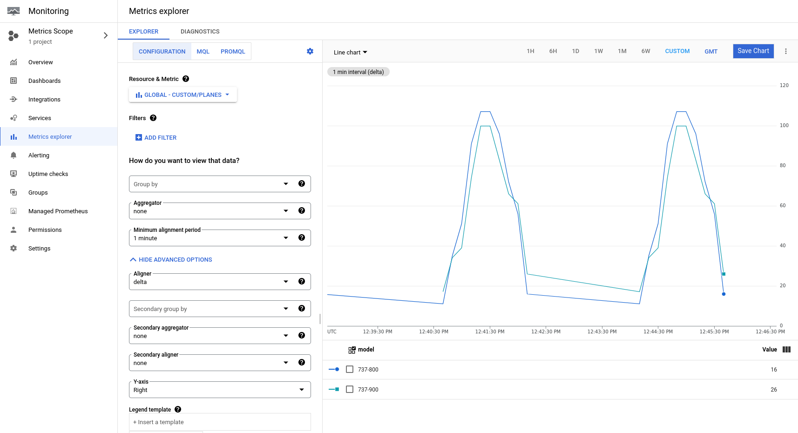

# Quantify

Quantify is a library designed to simplify the interface to Google Cloud Metrics in Go. It
effectively wraps the [monitoring](https://pkg.go.dev/cloud.google.com/go/monitoring/apiv3)
client with the aim of reducing its complexity.

## Supported Metrics

### CUMULATIVE

Curently, Quantify only supports the [CUMULATIVE MetricKind](https://cloud.google.com/monitoring/api/ref_v3/rest/v3/projects.metricDescriptors#metrickind).
This allows tracking the running "counts" of things, for example, the number of error occurrences.

## Example

### Create Client

The Quantify client requires an underlying `monitoringpb.MetricClient` to be able to connect to Google Cloud. A default
client will be created if no other options are specified, but in the example below, you can see how to provide a
preconfigured client to Quantify along with a chosen ResourceType.

```go
    // google cloud monitoring client
    m, err := monitoring.NewMetricClient(context.Background(), option.WithCredentialsFile("/path/to/file.json"))

    // Quantify client
    cli, err := quantify.New(
        context.Background(),
        quantify.OptionWithCloudMetricsClient(m),
        quantify.OptionWithResourceType(&quantify.Global{
            ProjectId: "quantify",
        }),
    )
    if err != nil {
        panic(err)
    }
```

### Count Metrics

```go
    // create counters
    b738Counter, err := cli.CreateCounter(
        "planes",
        map[string]string{
            "manufacturer": "boeing",
            "model":        "737-800",
        },
        10,
    )
    if err != nil {
        panic(err)
    }
	
    // count 10 times
    for i := 0; i < 10; i++ {
        b738Counter.Count()
    }
```

## Google Cloud Monitoring

Below is an example of what the counter metrics look like in Google Cloud Monitoring once reported. The counts shown
below were reported as a Global resource (where only the `project_id` parameter is provided), and were located in the
Metrics explorer under:

`Global > Custom > custom/planes`

As the metric was named `planes` when the counters were created.

